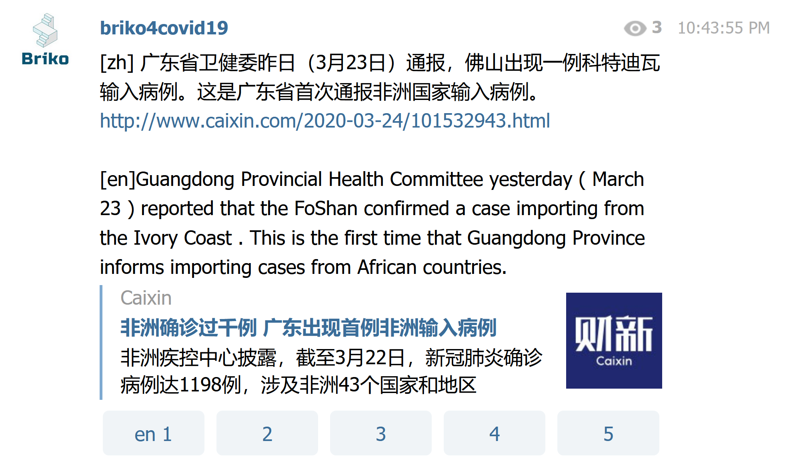

# COVID-19 Telegram新闻机器人
----------
## Open source repo
* Telegram Bot https://github.com/briko-org/brikobot

## 我们为什么做这个 COVID-19 新闻机器人

从WHO宣布COVID-19全球大流行开始，世界各地的人们都开始关注和这种冠状病毒相关的信息。但是限于语言障碍，人们不知道其它国家的社交媒体上发生了什么，也很难从中学习其它国家的做法。

比如，韩国如何在2天内就开始使用了drive-thru的不下车病毒检测站？为什么日本坚持奥运会有可能如期举行？中国现在没有新增了吗？要立刻找到相关新闻本来也很不容易，要用一种你不懂的语言找新闻就更困难了。

所以我们提供了这个新闻机器人，它可以帮你翻译新闻摘要和SNS上的消息，让你得到各种语言的最新消息。你可以做贡献者来提交新闻和辅助翻译，也可以订阅新闻频道的推送，参与给翻译质量打分。

## COVID-19新闻机器人如何工作

* 我们通过一个Telegram 机器人来帮助志愿者完成翻译工作，再通过Telegram频道 https://t.me/briko4covid19 来发布这些新闻和有价值的社交媒体信息。

* 不同背景，不同母语和文化的志愿者一起把自己看到的有价值新闻和信息提供给机器人进行翻译。 

* 机器人把收到的内容翻译成几种语言，然后通过Telegram频道推送出去。

* Telegram频道的订阅用户可以收到推送的消息，还可以对翻译质量打分帮助提升翻译质量。

* 所有数据最终都会用来训练更好的机器翻译模型，提供更准确的翻译结果

* 欢迎加入志愿者团队，寻找有价值的新闻，在AI的帮助下翻译，推送给订阅用户。

## 为什么有时候翻译质量很糟糕，我们怎么才能提升它？

很简单，我们缺少高质量的语料。翻译机器人没有学习过coronavirus这个词在其它语言中应该对应什么，也就无法正确翻译它。实际上大部分普通人，也只是在这几个月才开始听过这个词。这类翻译工作急需医疗健康方面的语料，但是大部分这样的语料都被几家大企业垄断。

如果有足够的不同语言的文本语料，翻译机器人可以给出更好的翻译。无论你愿意做志愿者辅助翻译，或者作为新闻读者只是参与打分，都可以帮助提升翻译质量，如果你是这个领域的专业人士，那就能提供更大的帮助。

只需要点一下对应的分数按钮就可以打分，如果你两种语言都懂，就能提供很有用的反馈。

## 社区可以得到什么？

我们不保留任何东西，全部开源。我们的计划但不仅限于以下：

* Telegram机器人本身的源码
* 我们支持的各种语言的文本语料库
* 处理这些文本语料的代码
* 我们用这些文本语料训练出的机器翻译模型
* 用户贡献和帮助提升的数据，新闻和消息

我们希望这些工作完全透明，所有人都可以从这个项目中获益。

无论你是想了解关于冠状病毒相关的消息，或者通过阅读学习一门新语言，或者想尝试机器学习翻译模型，或者想自己做个机器人…都可以，欢迎加入我们。
